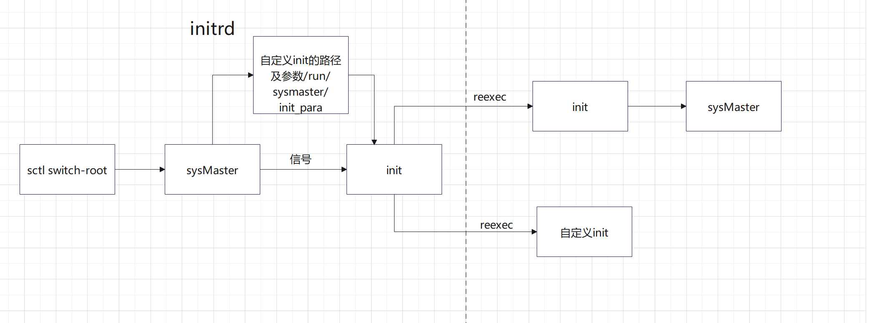

# service设计文档

## 1    概述

switch-root用来切换到不同的根目录并执行新的系统管理进程

## 2    特性需求概述

NA

## 3    需求场景分析

### 3.1    特性需求来源与价值概述

switch-root是切换根目录主要实现， 用于将已安装的/run、/proc/、dev/和/sys移动到newroot，使newroot成为新的根文件系统并启动init进程。

## 3.2    特性场景分析

系统启动后将initrd切换到新的根目录文件系统

## 4    特性/功能实现原理

### 4.1    总体方案

总体包含2个部分，switch-root程序以及sctl switch-root命令。

switch-root:将"/dev", "/proc", "/sys", "/run"move至新根目录下，pivot_root chroot chdir新的根目录，清除旧目录内容。
sctl switch-root: 该命令通知sysMaster，将用户自定义的init及参数信息写入文件中，通过信号通知init，init读取文件中信息，如果用户指定init，则reexec用户自定义init，否则init将reexec自身，然后reexec sysMaster，完成在新的根目录文件系统中执行init进程
 

              basic.target
                   |
                   v
          initrd-switch-root.target
                   |
                   v
        initrd-switch-root.service
        (先运行switch-root切换根目录)
(后运行sct switch-root在新的根目录启动init进程)
                   |
                   v
         切换到主机上的操作系统

## 5可靠性/可用性/Function Safety设计

NA

## 6    安全/隐私/韧性设计

NA

## 7    特性非功能性质量属性相关设计

NA

## 8    数据结构设计（可选）

本章节完成数据库结构的设计（数据库表结构，可以使用Power Designer完成），可选章节。

## 9    词汇表

NA

## 10   其它说明

NA

## 11   参考资料清单

NA
